# Dev environment

Nothing about developing this mod runs on the Linux desktop. Gradle, the Minecraft downloads and
the test server all live in a kubernetes cluster elsewhere, so the desktop only holds the source
and issues commands.

## Which cluster

There are two, and `scripts/dev.sh` names the one it wants rather than inheriting whatever
`kubectl config current-context` happens to say:

| Context | What it is | When |
| --- | --- | --- |
| `eero-pc` | k3s on the eero-pc box on the LAN. 8 CPUs, 15.5 GB, x86_64. | The default. Everything below assumes it. |
| `mac-docker-desktop` | the older `kind` cluster on the MacBook Air. 8 CPUs, 24 GB, arm64. | The fallback, when eero-pc is down or you are working from the Mac. |

```sh
scripts/dev.sh gametest                                   # eero-pc
MHR_CONTEXT=mac-docker-desktop scripts/dev.sh gametest    # the Mac
MHR_CONTEXT= scripts/dev.sh gametest                      # whatever context is current
```

The context is passed explicitly on every `kubectl` call the script makes. That is not
belt-and-braces: the current context is process-wide state that another terminal or another agent
session can change underneath you, and the failure it produces is not an error — it is a build or
a gametest run that went to the other cluster and reported success.

The two clusters share nothing. Each has its own volume, its own Gradle cache, its own gametest
image and its own dev world, so the first command against a cluster you have not used lately
re-downloads Minecraft.

## Shape of it

Namespace `mhr-dev`, one 40 GB volume, three pods:

| Pod            | Image                    | Job |
| -------------- | ------------------------ | --- |
| `mhr-build`    | `gradle:jdk25`           | Sleeps. You exec Gradle in it. Holds the source tree and the Gradle cache. |
| `mhr-gametest` | `mhr-gametest` (baked)   | Sleeps. Runs the automated gameplay tests, client and all. |
| `mhr-server`   | `itzg/minecraft-server`  | A Fabric 26.3 dedicated server with the mod in its `mods/`. |

The volume is laid out as `/workspace` (source), `/gradle` (cache and the Minecraft artifacts),
`/server` (the server's game directory) and `/gametest` + `/gradle-gametest` (the test pod's own
tree and cache). The build and test pods see everything under `/pvc`; the server pod sees only
`/server`, mounted at its usual `/data`.

Both survive restarts. The expensive part — Minecraft, mappings, the Gradle cache — is downloaded
once and stays on the volume.

## Minecraft 26.3 has no mappings

Worth knowing before you touch the build file, because it trips up every older guide:

- **Minecraft is unobfuscated from 26.1 onwards.** Mojang stopped publishing obfuscation mappings,
  and Fabric stopped updating Yarn and intermediary after 1.21.11. The names in the jar are the
  real ones.
- So there is **no `mappings` dependency** in `build.gradle`, and **no `modImplementation`** —
  that configuration exists only to remap a dependency, and nothing needs remapping.
- The plugin id must be `net.fabricmc.fabric-loom`. The bare `fabric-loom` id is the legacy one
  and still insists on mappings; `net.fabricmc.fabric-loom-remap` is for 1.21.11 and older.
- Loom refuses to run on anything below **JDK 25**, which is why the build pod is `gradle:jdk25`
  even though the mod compiles to Java 21.

26.3 also reshaped a lot of the worldgen and command API. When a name is wrong, read it out of the
jar rather than guessing:

```sh
scripts/dev.sh shell
javap -cp /pvc/gradle/caches/fabric-loom/minecraftMaven/net/minecraft/minecraft-merged-deobf/26.3/minecraft-merged-deobf-26.3.jar \
  net.minecraft.world.level.levelgen.feature.TreeFeature
```

## Everyday use

```sh
scripts/dev.sh up      # first time only: create everything and wait for it
scripts/dev.sh go      # sync + build + install the jar + restart the server
scripts/dev.sh logs    # follow the server log
```

`go` is the loop. Edit here, run `go`, reconnect. A rebuild after a small change takes seconds;
the server restart is the slow part, about half a minute.

Other commands: `sync`, `build`, `deploy`, `client`, `gametest`, `image`, `console`, `rcon`,
`shell`, `newworld`, `status`, `down`, `nuke`. Run `scripts/dev.sh` with no arguments for the list.

`sync` copies exactly what a commit would see — tracked files plus untracked ones that are not
gitignored. It wipes `src/`, `k8s/` and `scripts/` in the pod first so deleted files do not
linger, and leaves `build/` and `.gradle/` alone so rebuilds stay fast.

## The run lock

The cluster is shared and there is one of each pod, so two people working at once used to break
each other's runs. `sync` wipes the source tree before copying it again, which pulls the ground out
from under a build already running; and the gametest pod has a single network namespace, so the
second dedicated test server to start cannot bind port 25565 and dies with `Address already in use`.
Both look like your code failing, and neither is.

So runs are serialized. `sync`, `build`, `deploy` and `go` take the build pod's lock, `gametest`
takes the gametest pod's, and each holds it for the whole command. The two locks are separate, so a
build and a gametest still run at the same time. When somebody else has the pod you just wait:

```
Another run is using the gametest pod (eero@Eero-bazzite, started 09:12:40).
Waiting up to 2700s...
Got the gametest pod after 314s.
```

`MHR_LOCK_WAIT` (seconds, default 45 minutes) bounds the wait.

The lock is an `flock` in the pod, and the shell that takes it is the shell that does the work:
`scripts/dev.sh` writes the whole protected part of a command as a script, streams it into one
`kubectl exec`, and that remote shell takes the lock and runs it. The source tarball goes in before
the lock is taken and the test artifacts come back out after it is gone, because neither touches
anything shared.

Nothing on your machine holds the lock, which is the point. The work runs as a child of the shell
holding it, so it inherits the lock's file descriptor, and the kernel only drops an `flock` when
the last descriptor on it closes. The lock outlives the work rather than the other way round: there
is no moment where the lock is free and the work is still going, so nothing can slip into the pod
during a handover, because there is no handover.

Nothing needs unlocking by hand either. If your command exits, crashes, is killed — `kill -9`
included — or loses its connection to the cluster, the exec stream ends, the pod sees its end of it
close, and it stops the work and drops the lock within a second or so. A worker that dies mid-run
cannot leave the pod locked, and cannot leave its half-finished gradle running there either.

A `deploy` holds the lock across the server rollout as well, not just the jar copy. The two belong
together: a second deploy landing between them would leave the first one restarting the server onto
somebody else's jar and calling it a success.

`shell`, `gametest-shell`, `console`, `logs` and `rcon` deliberately take no lock — a shell left
open would block everybody. Don't sync or build from inside one while someone else holds the lock.

Once the gametest lock is held, a JVM still running in that pod is either debris from a run that
died — usually a client still holding 25565, which would fail your run for somebody else's reason —
or somebody running without the lock, from an old checkout of the script or from
`gametest-shell`. Those look identical from outside and want opposite treatment, so `gametest`
waits `MHR_STRAY_GRACE` (default 10 minutes): a real run finishes, debris does not. When the pod is
idle this costs nothing.

Waiting narrows the ambiguity but cannot remove it — a run can simply be slower than the grace
period. So if something is still there when the grace runs out, the command stops and tells you
what it found rather than guessing. Killing is your decision:

```sh
MHR_KILL_STRAYS=1 scripts/dev.sh gametest
```

It then kills what it found and checks the pod is actually clear before the run goes on.

That default is deliberately the cautious one, and it is not hypothetical caution: while this was
being written, a session testing the kill path took a JVM for debris and it was another worker's
live client gametest, running from a branch older than the lock. Until the lock is on main and
every branch in flight carries it, a JVM in that pod is as likely to be somebody working as it is
to be rubbish. Once nothing can run without the lock, this default can flip to killing.

The check runs in the pod, inside the critical section, so there is no network between the question
and the answer. Either way, nothing is assumed: if the check cannot run, the command stops. A check
that did not happen is not the same as a pod that is clear, and treating it as one is how you end
up back at `Address already in use`.

## Automated gameplay tests

One command, no human in a Minecraft client:

```sh
scripts/dev.sh gametest
```

It syncs the tree, then runs three things in order and stops at the first that is red:

| Step | What it is |
| ---- | ---------- |
| `test` | The plain-Java unit tests — balance parsing and the like. No game. |
| `runGameTest` | Fabric's server GameTests: a dedicated server, no client. |
| `runClientGameTest` | Fabric's client GameTests: a **real Minecraft client** driving a **real dedicated server**. |

The last line is `PASS` or `FAIL`, and the exit status matches, so it can be the whole of a PR
check. There is nothing to confirm between iterations: change the code, run it again.

### Where it runs

In a third pod, `mhr-gametest`, not in the build pod and not against the dev server. It runs an
image of its own — the same `gradle:jdk25` base with `xvfb` and Mesa's software OpenGL driver
baked in, see [The gametest image](#the-gametest-image). Nothing in the cluster has a GPU, so the
client renders with `llvmpipe` into a 1280×720 virtual display. That works, and it is slow: a full
run is minutes, most of it the client starting.

It has a Gradle cache of its own (`/pvc/gradle-gametest`) and a source tree of its own
(`/pvc/gametest/workspace`), so it neither waits for nor breaks someone else's `scripts/dev.sh go`.
The container is root so that its startup script can chown the directories it makes on the shared
volume; Gradle itself is dropped back to uid 1000, so nothing root-owned lands on the volume.

That source tree is shared between people, though, the same way the build pod's is — so `gametest`
takes the pod's lock and holds it for the whole run. A second run waits instead of overwriting the
first one's `src/` halfway through. See [The run lock](#the-run-lock).

The Gradle cache stays shared either way, which is the part worth sharing. A tree of your own is
still available when you want one, for instance to keep a half-finished experiment around:

```sh
MHR_GAMETEST_WORKSPACE=/pvc/gametest/workspace-mine scripts/dev.sh gametest
```

Two things had to be arranged for the client to start headless at all, both in `scripts/dev.sh`:

- **`SDL_VIDEO_FORCE_EGL=1`.** 26.3 asks SDL for the OpenGL context, SDL prefers GLX, and llvmpipe
  on a bare Xvfb has no GLX visual matching what the game asks for. EGL does. Without this the
  client dies on `Couldn't find matching GLX visual` before any test runs. Note the name: the SDL2
  spelling was `SDL_VIDEO_X11_FORCE_EGL` and SDL3 ignores it silently, which looks exactly like the
  variable not working.
- **Xvfb at 24-bit colour**, started once per pod and reused.

### The gametest image

The X and Mesa packages used to be `apt-get`-ed every time the pod started: a dependency on
Debian's mirrors being up at that moment, and a test environment that was whatever apt resolved
that day. It also cost about 15 seconds of every pod start — scheduled-to-ready measured 21s
before and 6s after, so if you came here looking for the minute or two the original issue
estimated, it is not there. Pinning the environment is the reason that survived. They are baked
into an image now,
[`k8s/gametest.Dockerfile`](../k8s/gametest.Dockerfile), and the pod's startup script is down to
making directories and sleeping.

Building it is the one thing that cannot be done from this machine. There is no registry (see
below), so the image has to be handed to the cluster node's own containerd — and the node is never
this desktop. `scripts/dev.sh image` therefore does not build anything; it prints the command to
run **on the node**, generated from the Dockerfile so the Dockerfile stays the only copy of what
goes into the image. It prints a different recipe per context, because the two nodes take an image
by different routes:

- **eero-pc** is a k3s box, so the image is built with `podman` and imported with
  `podman save … | sudo k3s ctr -n k8s.io images import -`. Only the import needs root.
- **the Mac** is a `kind` cluster whose node is a container on Docker, so the image is built for
  `linux/arm64` and imported with `docker save … | docker exec desktop-control-plane ctr …`, which
  is exactly what `kind load docker-image` does.

```sh
# 1. bump the tag in k8s/dev.yaml if the Dockerfile changed
# 2. print the build command, and run what it prints on the cluster node
scripts/dev.sh image
# 3. put the new tag in the cluster and wait for the pod
kubectl --context eero-pc apply -f k8s/dev.yaml
kubectl --context eero-pc -n mhr-dev rollout status deploy/mhr-gametest --timeout=5m
```

`apply`, not `rollout restart`. A restart rolls the deployment as the cluster already has it, so
it would faithfully start the old tag again; the new tag only exists in your local
`k8s/dev.yaml` until something applies it.

**There is no registry, and that is deliberate.** The command imports the built image straight
into the node's containerd. An in-cluster registry was the other option and is worse here:
containerd refuses plain-HTTP registries even on `localhost`, unlike the old Docker daemon, so it
would need either a TLS certificate or a `hosts.toml` dropped on the node — on *each* node, now
that there are two, and Docker Desktop tends to reset node-level configuration across restarts
anyway. The import route leaves no standing infrastructure to keep alive.

Two consequences worth knowing:

- **The tag is pinned in `k8s/dev.yaml`** (`mhr-gametest:1`) and `scripts/dev.sh image` reads it
  from there. Change the Dockerfile, bump the tag in the manifest, rebuild, apply — otherwise the
  node keeps the old image under the old name and nothing tells you.
- **`imagePullPolicy: Never`.** Nothing can pull this image from anywhere. A pod stuck on
  `ErrImageNeverPull` means the node has never been given the image, not that a pull failed.

### Test isolation

Nothing carries over between runs. Loom wipes `build/run/clientGameTest` before each one, and that
directory is the client's *and* the dedicated server's game directory, so the world, the config
directory, each save's `hardcore-roguelite-progress.json` and the player's inventory all start empty.
Every `worldBuilder()` call is a new save, so it is also a new roguelite profile with nothing
bought. On top of
that every scenario sets up the state it depends on rather than inheriting it — the equipment ones
lock all five slots and empty the player, the tree ones set `world.trees` to what they need and
clear their own patch of ground, the animal ones lock all six species — so one scenario cannot make
the next one pass, and the order they run in does not matter.

The *pod* is shared, and two runs at once used to collide in two ways: they overwrite each other's
`src/` halfway through, and the second one's dedicated server cannot bind port 25565 and dies with
`Address already in use`. Neither is a failure of the thing being tested, and a source tree of your
own only fixes the first — one pod means one network namespace, and only one process can hold 25565.
So runs are serialized instead: see [The run lock](#the-run-lock).

The ore scans go further, because worldgen only answers once per chunk: each of them builds a world
of its own from a fixed seed, sets all seven ore unlocks explicitly before a single chunk of the
scanned patch exists, and only then generates it. Land that had already been generated would answer
for whatever the unlocks were when it was made.

### Artifacts

`scripts/dev.sh gametest` copies logs, screenshots and crash reports back to `build/gametest/`
whether the run passed or failed:

```
build/gametest/run/clientGameTest/screenshots/*.png   what the client saw
build/gametest/run/clientGameTest/logs/latest.log     the client log
build/gametest/run/gameTest/logs/latest.log           the server GameTest log
build/gametest/reports/tests/...                      the unit-test HTML report
```

### Reading a failure

Both test logs mark each scenario the same way:

```
=== scenario locked-helmet-slot-refuses-a-helmet ===
=== scenario locked-helmet-slot-refuses-a-helmet: PASS ===
```

A failed one logs `FAIL` with the assertion message, writes
`screenshots/<n>_failed-<scenario-name>.png` if it is a client scenario with a screen worth
photographing, and carries on to the remaining scenarios — so one run
tells you everything that is broken, not just the first thing. The run ends by throwing with the
whole list, which is what turns the exit status non-zero.

An assertion message names what was expected in plain words, for example *"a locked helmet slot
must stay empty after a click that tries to fill it"*. The item-conservation ones also print the
count they found.

#### A red run with no failed scenario in it is the node, not the mod

A client run can also die without any scenario failing at all. What that looks like:

```
A single server tick took 60.00 seconds (should be max 0.05)
Considering it to be crashed, server will forcibly shutdown.
```

and a thread dump whose render thread is inside `glDrawArraysInstanced`. This is not a hang in
anything the mod did. The client gametest API runs the client and the server **in lockstep**, so
the server's tick does not finish until the client's frame does — and the client renders with
llvmpipe on a shared node. A frame that takes a minute is therefore recorded as a crashed server
tick, and Minecraft's own watchdog kills the server.

It shows up in whichever client scenario happens to be drawing something heavy at the time, so the
class named in the log means nothing. Check the node before touching any test:

```sh
kubectl --context eero-pc -n mhr-dev exec \
  "$(kubectl --context eero-pc -n mhr-dev get pod -l app=mhr-gametest \
    -o jsonpath='{.items[0].metadata.name}')" -- sh -c 'uptime; nproc'
```

A load average well above the core count is the whole explanation. On the MacBook Air cluster this
was measured at 18 and then 21 against six cores, with the dev server and another worker's run on
the same node, and it produced three red runs in a row in three different places. Wait for the node
to be quiet and run it again rather than adding a timeout or a retry to a test.

The same shape has a second face worth recognising: instead of the watchdog, the first client test
dies with a `TimeoutException` out of `DedicatedServerImplUtil.start` having run no scenario at
all. That is the same overloaded node failing to start a server inside the harness's own deadline.

### What is automated now

#### The equipment slots

These were manual client checks and are not any more, in
`src/gametest/java/fi/vilpponen/mhr/gametest/client/EquipmentLockClientTest.java`:

- **locked-helmet-slot-refuses-a-helmet** — real mouse clicks pick the helmet up and drop it on the
  armor square; the slot stays empty and the helmet still exists exactly once.
- **unlock-while-connected-then-equip** — `mhr unlock player.slot.helmet` with the inventory open;
  the client's copy of the unlock flips at once and the same clicks now equip it.
- **offhand-swap-hands-locked-then-unlocked** — the real swap-hands key, refused while the offhand
  is locked and vanilla once it is not.
- **locking-an-occupied-slot-empties-it** — `mhr lock` on a slot in use empties it on the spot and
  the shield comes back.
- **reconnect-keeps-a-locked-slot-empty** — wear a helmet, disconnect, lock the slot, reconnect: the
  slot is empty, the helmet is in the inventory and the client is told about the padlock again.

Every one of them ends by counting every copy of the item the player could still reach — inventory,
equipment, the cursor, and the ground — so "refused" can never quietly mean "destroyed".

The two inventory screenshots are worth a look, because they are the padlock check the docs used
to ask a human for:

| Helmet slot locked | ...and the moment after `mhr unlock player.slot.helmet` |
| ------------------ | ------------------------------------------------------ |
| 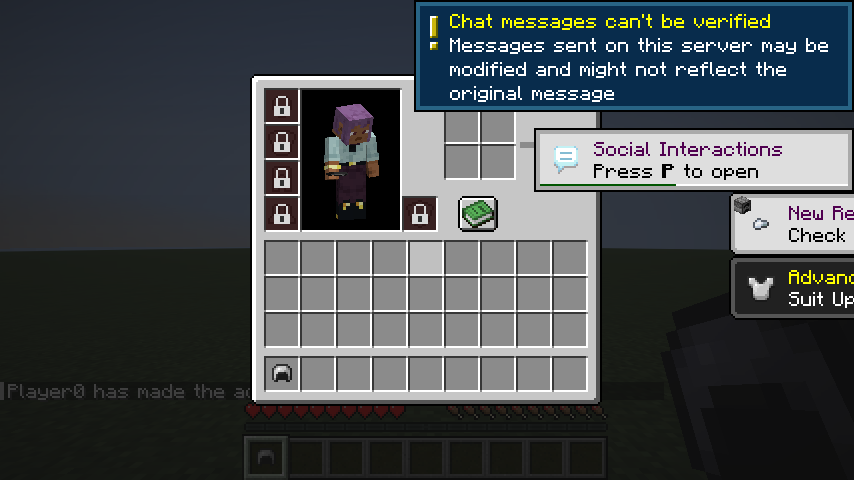 | 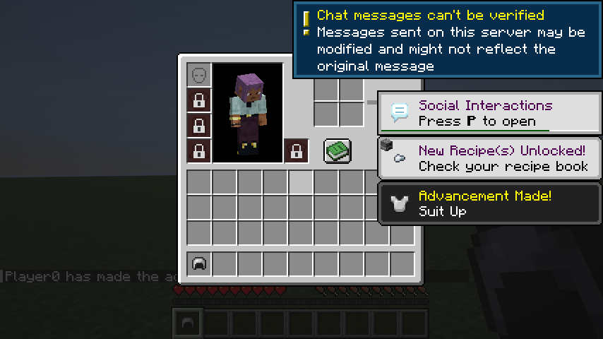 |

Five padlocks become four, with the helmet square back to its vanilla empty icon, without the
inventory being closed and reopened.

The clicks are real. The cursor is moved to the middle of the square and the click is only sent once
the screen itself agrees that is the square under the pointer, so a layout change makes the test
fail rather than silently click somewhere else.

#### The trees unlock

Trees need no client, so most of them are **server GameTests** — the fast step, seconds rather than
minutes. They live in `src/gametest/java/fi/vilpponen/mhr/gametest/TreeUnlockGameTest.java` and each
one lays its own patch of dirt and asks a vanilla feature to place itself on it, which is the same
call worldgen, bonemeal and a sapling all come down to:

- **locked-world-refuses-a-tree-feature** / **unlocked-world-places-a-tree-feature** — the
  `place feature minecraft:oak` check the section below used to ask a human to type.
- **locked-world-refuses-a-fallen-tree** / **unlocked-world-places-a-fallen-tree** — the same for
  fallen trees, which are a free pile of logs and so have to go too.
- **sapling-will-not-grow-while-locked** / **sapling-grows-once-unlocked** — a sapling pushed along
  the way bonemeal pushes it. Locked, it is still standing afterwards and no logs exist; unlocked,
  it is a tree.
- **unrelated-vegetation-still-places-while-locked** — a flower patch still places while trees are
  locked. This is the control: a mixin that quietly stopped *every* feature would pass all of the
  above and be caught only here.

The real worldgen path cannot be checked there, because Fabric's server GameTests run on a superflat
world with no trees in it to suppress. So it gets a client GameTest of its own, in
`src/gametest/java/fi/vilpponen/mhr/gametest/client/TreeWorldgenClientTest.java`, which builds a
dedicated server on an *ordinary* overworld instead of the harness's flat one:

- **the-world-a-run-starts-in-has-no-trees** — the land the server made around spawn by itself, with
  nothing force-loaded. No logs, and ground blocks in the thousands so that "no logs" means
  something.
- **fresh-land-has-no-trees-while-locked** — a plain `minecraft:forest` about six thousand blocks
  out, force-loaded into existence on the spot. Still no logs.
- **fresh-land-has-trees-once-unlocked** — `mhr unlock world.trees`, then a *different* forest six
  thousand blocks the other way. Logs in the hundreds.

Two different forests on purpose: worldgen only applies to chunks made after the change, so scanning
the same patch twice would answer "no trees" both times and look exactly like the feature working.
Plain `minecraft:forest` on purpose too — a biome *tag* also matches places like a mushroom island,
which has no trees in vanilla either, and "no logs where there never were any" proves nothing.

| Fresh forest, trees locked | ...and a fresh forest after `mhr unlock world.trees` |
| -------------------------- | ---------------------------------------------------- |
| 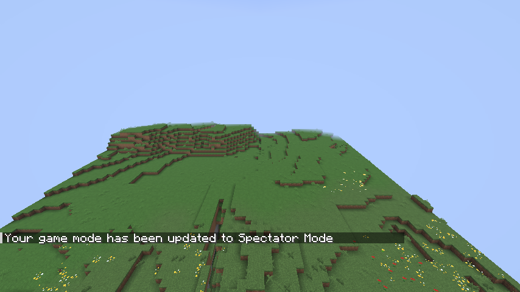 | 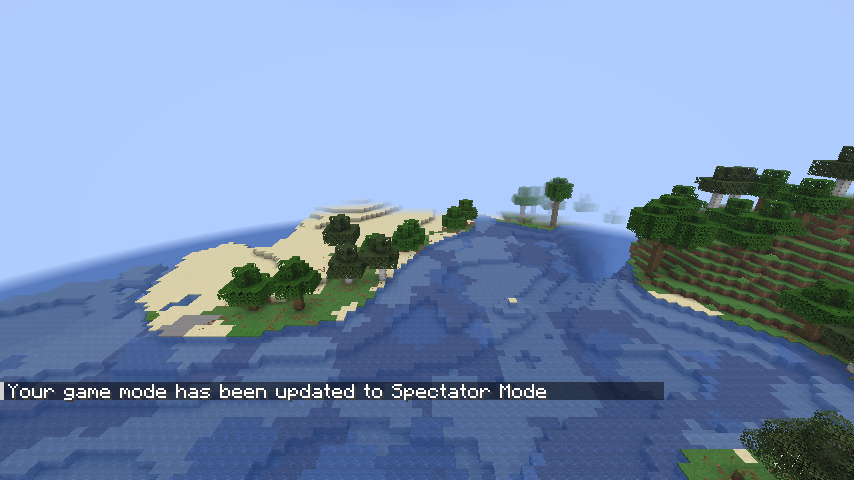 |

#### The animal unlocks

The whole of [Testing the animal unlocks](#testing-the-animal-unlocks) used to be a page of rcon
commands and a warning that half of it needed a player online. It does not any more. Two tests
share the work, because the feature has a fast exact half and a slow realistic half and neither
one is enough on its own.

`src/gametest/java/fi/vilpponen/mhr/gametest/server/AnimalSpawnGameTest.java` is the exact half:
one server GameTest, no client, 29 scenarios in under two seconds. It asks the two vanilla calls
the feature actually hangs off — `SpawnPlacements.checkSpawnRules`, which both halves of natural
spawning consult, and `EntityType.create`, which is how a mob is built once something has decided
to make one. Per species, and then across species:

- **unlocked-&lt;species&gt;-spawns-the-vanilla-way** — with the species bought, vanilla's own rules
  say yes on a lit patch of grass and the game hands back a real animal. This is the scenario that
  stops every "must not spawn" check below from passing for the wrong reason.
- **locked-&lt;species&gt;-never-spawns-by-itself** — the spawn tick, chunk generation and the jockey
  door all refuse it.
- **locked-&lt;species&gt;-can-still-be-made-on-purpose** — spawn eggs, commands, breeding, spawners,
  structures, dispensers, conversions and events all still work while it is locked.
- **unlocking-&lt;species&gt;-leaves-the-other-five-locked** — the mixed state a real save is almost
  always in.
- **summon-still-works-with-every-species-locked** — a real `/summon` through the real command
  dispatcher, once per species, counted afterwards.
- **locking-every-species-leaves-other-mobs-alone** — eleven bystanders, from a rabbit to a creeper
  by way of a mooshroom and a donkey, must answer exactly what they answered with all six bought.
  The two states are compared rather than "yes" being demanded, because some of them cannot spawn
  on a lit patch of grass in the first place.
- **locked-chicken-gets-no-jockey-chicken** and **unlocked-chicken-gets-its-jockey-back** — 200 real
  baby zombies, finalized the way the natural spawner finalizes them. The zombies are forced to be
  babies through `ZombieGroupData`, so the only roll left is vanilla's own 5% jockey chance, and
  200 tries miss it about three times in a hundred thousand runs.
- **a-locked-chicken-does-not-stop-the-other-jockeys** — spider, strider, skeleton and zombified
  piglin are somebody else's mobs.

`src/gametest/java/fi/vilpponen/mhr/gametest/client/AnimalWorldgenClientTest.java` is the realistic
half, and the only one that can answer "does fresh terrain come out empty". It builds a dedicated
server on a *normal* overworld, walks out to land nobody has been to, force-loads 15×15 chunks of it
and counts what is standing there:

- **fresh-plains-have-no-animals-while-every-species-is-locked** — zero of all six, with the ground
  count as the control so an ungenerated patch cannot pass.
- **fresh-plains-fill-up-once-every-species-is-bought** — all six turn up again, which is what makes
  the scenario above mean something.
- **a-mixed-lock-state-shows-up-in-fresh-land** — only the cow bought: cows walk in, the other five
  do not.
- **locking-every-species-leaves-other-animals-alone** — a patch of taiga, whose list is mostly
  *not* ours, keeps its foxes and rabbits with all six locked.

A different patch is used for every unlock state on purpose. The animals a chunk is born with are
placed once, while it is being made, so scanning the same patch twice would answer "no cows" both
times and look exactly like the feature working.

Two things had to be arranged for any of this to be a test rather than a coincidence, and both are
worth knowing before writing the next worldgen test:

- **`gamerule spawn_mobs true`.** The harness makes its world with mob spawning off, so its own
  tests are not disturbed by wandering mobs. Without turning it back on, every patch generates empty
  and every count reads zero — which is indistinguishable from the feature working.
- **`mhr border infinite`.** A run starts on the tiny border tier and land outside the border never
  gets its animals at all. Same failure, same disguise.

The two plains shots are the pair worth looking at. Same camera geometry both times — aimed at the
thickest cluster of animals when the patch has any and at its most level open ground when it has
none — so the only difference in the picture is the thing the test is about:

| Fresh plains, every species locked | ...and fresh plains with all six bought |
| ---------------------------------- | --------------------------------------- |
| 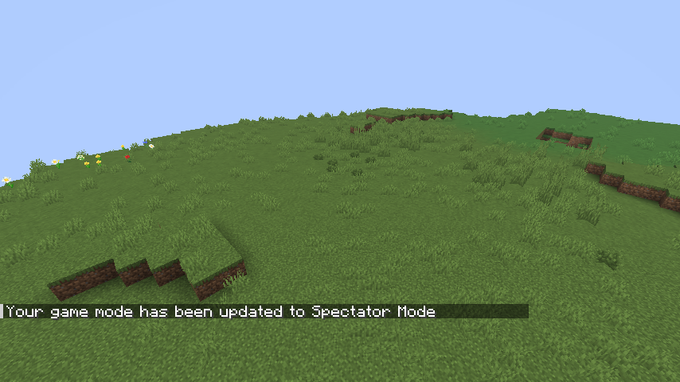 | 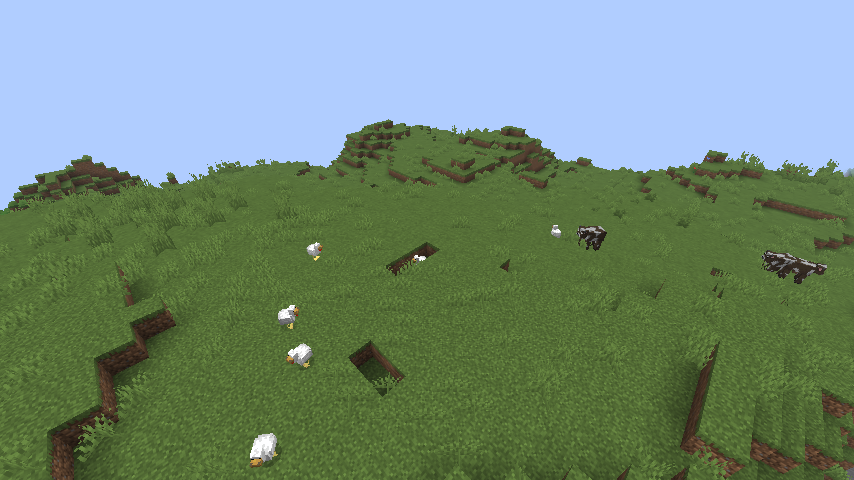 |

And the mixed state, which is what a save in progress actually looks like — the cow bought and
nothing else, so the field has cows in it and nothing else the shop sells:

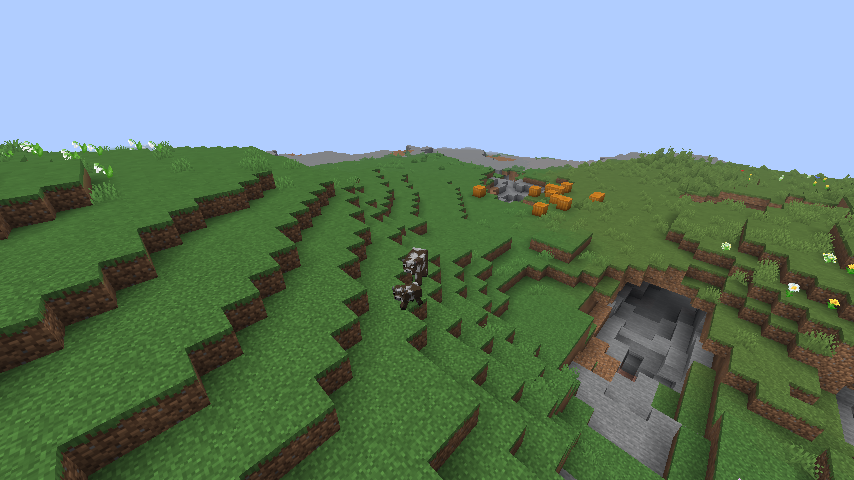

#### The ore unlocks

Two files, because the feature has two halves and they are reached in completely different ways.

`src/gametest/java/fi/vilpponen/mhr/gametest/server/OreFeatureTest.java` is a **server GameTest**:
no client, no terrain, a box of stone inside the test region and the real vanilla ore feature run at
the middle of it. It is the console's `place feature` check, one command instead of a human:

- **locked-`<ore>`-places-nothing** — for all seven ores. With the ore locked, none of eight fixed
  seeds places anything and the stone is untouched.
- **unlocked-`<ore>`-places-while-the-others-stay-locked** — buy that one ore, and its vein lands;
  then every *other* ore's feature is tried in the same breath and still refuses. That is the
  mixed-state check, and it runs 42 times, once per ordered pair.
- **locked-gold-covers-nether-gold-ore** — nether gold ore is gold, in netherrack, same unlock.
- **features-we-do-not-sell-are-untouched** — emerald, andesite, diorite and blackstone come out of
  the same two feature classes the mod intercepts, and all four place with every ore locked.

`src/gametest/java/fi/vilpponen/mhr/gametest/client/OreWorldgenClientTest.java` is the other half:
**real terrain, generated for real**. It builds three worlds from one fixed seed — every ore locked,
iron and diamond only, everything unlocked — and counts the same 12×12 chunks of never-visited land
in each:

- **the-three-scans-generated-the-same-world** — all three hold exactly the same bedrock. Nothing
  places or ticks bedrock, so this is what says the seed really did repeat and the ore counts differ
  because of the unlocks and nothing else.
- **locked-`<ore>`-is-missing-from-fresh-terrain** / **unlocked-`<ore>`-is-back-in-fresh-terrain** —
  for all seven, zero blocks against thousands.
- **mixed-state-restores-only-what-was-bought** — iron and diamond are in the ground, the other five
  are not.
- **large-iron-and-copper-veins-follow-their-unlock** — the deep veins, counted by their raw blocks,
  which nothing else in the game produces. Buying iron gives back *exactly* the veins the fully
  unlocked world has, while copper's stay out.
- **features-we-do-not-sell-are-untouched** — andesite, diorite and emerald are still down there
  with every ore locked. Only their presence is asserted, never their exact count: an ore vein is
  allowed to replace andesite, so a world with seven ores in it really does hold a little less.

It is a client game test for one reason: the client harness's world builder is the only thing that
can start a dedicated server on a seed of our choosing. No client ever connects, and it takes no
screenshots — there is nothing to see, the evidence is the counts, and they are printed per block
per world in the client log.

#### The crafted-tool enchant

Split the same way, and for the same reason. What may be rolled, on what and how high needs no
client at all, so it is a **server GameTest** in
`src/gametest/java/fi/vilpponen/mhr/gametest/CraftEnchantGameTest.java`. Each scenario builds a
crafting result the way the mixin does — a fresh stack handed to `CraftEnchant.enchantCrafted` — and
then asks what came out, which covers seventeen tools times forty rolls in about a second:

- **locked-unlock-leaves-every-tool-plain** / **every-supported-tool-comes-out-enchanted** — one
  level bought, and every tool kind and material comes out with something on it.
- **unsupported-items-stay-plain** — a bow, a crossbow, a trident, a fishing rod, shears, armour, a
  shield, planks, a chest. Half of them *are* enchantable and have an enchanting-table pool of their
  own, so the only reason they stay plain is the item tag. The other half is the control against a
  rule that started enchanting everything.
- **only-enchantments-that-fit-the-item-are-rolled** — the *"nothing impossible ever lands"* check.
  Every roll has to be one the game itself calls a primary fit for the item, inside the enchanting
  table's pool, not treasure, not a curse, and exactly one of them.
- **one-unlock-level-rolls-the-weakest-level** / **the-top-unlock-level-rolls-the-enchantments-own-maximum**
  — the curve, both ends. The second one also insists that something with more than one level turned
  up, because Silk Touch only goes to I and would satisfy "equals the maximum" for free.
- **recomputing-the-same-result-does-not-reroll** / **crafting-one-moves-the-roll-on** — the seed.

The crafting itself needs hands, so it is a **client GameTest** in
`src/gametest/java/fi/vilpponen/mhr/gametest/client/CraftEnchantClientTest.java`. The client stands
on a real crafting table, right-clicks it open, and carries the ingredients into the 3x3 grid one
square at a time with the real mouse:

- **a-locked-unlock-crafts-a-plain-pickaxe** — the whole recipe laid out by hand, and a plain result.
- **unlocking-while-connected-fills-the-output-slot** — `mhr unlock player.craft.enchant` with the
  table open, and the next recompute of the grid puts the enchanted pickaxe in the output slot.
  Asserted on the server *and* on the client's own copy, because the point of the feature is that
  you can see it before you take it.
- **taking-the-result-by-clicking-it** / **taking-the-result-by-shift-clicking-it** — both ways of
  getting it out give the item the output slot promised, and neither duplicates it.
- **the-recipe-book-gives-the-same-enchanted-item** — the third way in, covered below.
- **jiggling-the-grid-is-not-a-reroll** — an ingredient pulled out and put back six times over. Same
  enchantment every time.
- **crafting-one-and-setting-up-the-next-is-a-new-roll** — and the counterpart: really crafting one
  does move it on.
- **a-higher-unlock-level-rolls-higher** — at level 4, every roll is the enchantment's own maximum.
- **a-bow-in-the-same-grid-stays-plain** — with a pickaxe crafted straight afterwards as the control,
  so "plain" cannot mean "the unlock was off".
- **a-balance-reload-changes-the-curve** — writes an override into the config directory, runs
  `mhr reload`, and the very next item crafted comes out at the new level with the same enchantment
  on it. Then it takes the override away again and checks the shipped curve came back.

| The output slot, unlock locked | ...and after `mhr unlock player.craft.enchant` |
| ------------------------------ | --------------------------------------------- |
| 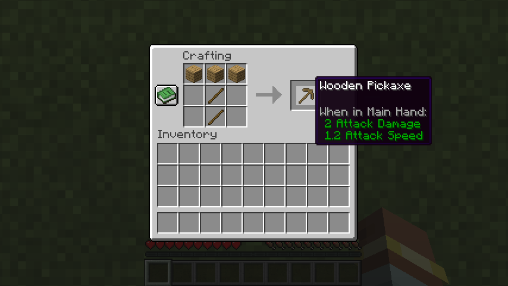 | 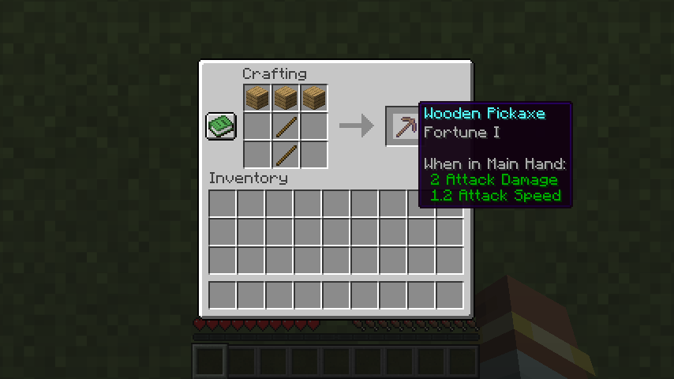 |

The pointer is parked on the output slot for both, so the tooltip spells out what is in there. The
enchantment line is what appears; the state assertions are still the proof.

Two things are worth knowing about the recipe book. A recipe has to be *known* before the book can
place it, and a fresh test player knows almost nothing, so the scenario runs `recipe give` first.
And the click on the recipe itself goes through `handlePlaceRecipe`, the method the recipe-book
button calls, rather than through the mouse: the book lays its recipes out in a paged component with
no stable handle on a single one, so aiming the pointer at whatever happens to be in that spot would
be a test of the page layout. Everything after that call is the real path, server round trip and all.

#### The villages unlock

Villages have nothing to place directly — there is no `place feature` for a structure — so unlike
trees there is no fast server-GameTest half. It is all real terrain, in
`src/gametest/java/fi/vilpponen/mhr/gametest/client/VillageWorldgenClientTest.java`, and it builds
**two** dedicated servers on ordinary overworlds, one for each side of the unlock:

- **a-fresh-world-has-a-village-to-find** / **the-village-really-generated** — with the unlock
  bought, `locate` finds a vanilla village out at x 8000, and the chunks around it, generated on the
  spot, record a village start. Found is not the same as built, which is why both are checked.
- **a-fresh-world-has-no-village-to-find** — a second world, built from scratch, with the unlock
  locked: no village anywhere within 48 chunks of the same starting point.
- **the-village-that-would-be-there-is-gone** — the same spot the first world put a village, in the
  same terrain, generated again: no village started there. Ground blocks in the thousands, so "no
  village" is not "no land".
- **unrelated-structures-still-generate** — a pillager outpost and a mineshaft still turn up while
  villages are locked. These are the two controls: a mixin that quietly refused *every* structure
  would pass everything above and be caught only here.
- **a-world-already-searched-cannot-prove-the-unlock** — buys the unlock in the world that has
  already been searched and shows the search still answers "nothing". This is the trap the two
  worlds exist to avoid, asserted rather than described.

Two whole worlds rather than two places in one, because `locate` writes down what it has already
looked at: a chunk searched while villages were locked keeps answering "nothing here" afterwards. The
harness pins the seed, so the two worlds are the same terrain — which is what makes "there was a
village at this spot, and now there is not" a sentence about the unlock rather than about two
different pieces of land. The unlocked world runs first, because only a world that has villages can
say where this seed puts one.

The harness also turns structure generation *off* in the worlds it makes, which the test turns back
on. Without that the locked half would pass for the wrong reason and the unlocked half could never
pass at all.

| Fresh land, villages unlocked | ...and the same spot with `world.village` locked |
| ----------------------------- | ----------------------------------------------- |
| 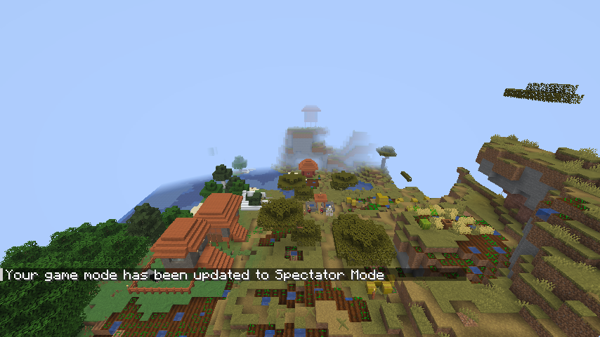 | 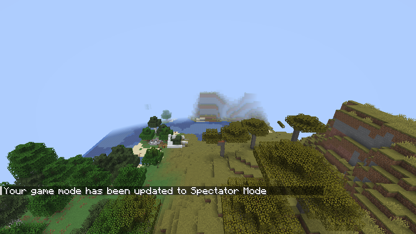 |

#### The starter chest

Split the same way, for the same reason: what goes in the chest is exact and needs no client, and
that joining a run is what puts it there needs a real one.

`src/gametest/java/fi/vilpponen/mhr/gametest/server/StarterChestGameTest.java` is the exact half.
Every scenario calls `RunStart.grant`, which is the single call both the first-join hook and
`mhr starterchest` come down to, so what is checked is the delivery itself:

- **nothing-owned-places-no-chest** — nothing bought is not an empty chest, it is no chest and no
  block touched. This is the control the rest of them lean on.
- **one-purchase-puts-a-chest-at-the-run-start** and **the-chest-holds-exactly-what-was-bought** —
  one chest next to where the run began, holding the five purchases and nothing else. What each
  purchase hands over is written out in the test rather than read from the catalogue, so a balance
  edit that changes it comes out red instead of agreeing with itself.
- **an-enchanted-starter-item-keeps-its-components** — the catalogue's Efficiency III pickaxe
  arrives enchanted. A stage that dropped the components would hand over a perfectly ordinary
  diamond pickaxe and look like it worked.
- **more-than-27-slots-makes-a-double-chest**, **a-double-chest-delivers-all-54-slots** and
  **past-54-slots-is-reported-and-nothing-vanishes-quietly** — 30, 54 and 60 slots. Both halves are
  real chests at the same height and the load is split 27 and the rest; at 60 the chest is still
  placed and still full, and what arrived plus what was reported missing is what was asked for, so
  an overflow can never be a purchase gone quietly.
- **an-override-and-a-reload-change-what-the-chest-holds** — a config override retunes
  `starter.bread`, `mhr reload` is run, and the very same server builds a chest of the new thing.
  Taking the override away again brings the bundled catalogue back.

The count-dependent ones retune a *pickaxe* on purpose: it does not stack, so "count" and "slots
used" are the same number and a scenario about 28 slots is one line of JSON.

`src/gametest/java/fi/vilpponen/mhr/gametest/client/StarterChestClientTest.java` is the half only a
real player arriving can answer. It builds three dedicated servers, because each one is a *run*: the
harness deletes the world before it starts a server, while the purchases live outside the world in
the progression snapshot, which is exactly the difference between rejoining and starting over.

- **first-join-of-a-run-places-the-starter-chest** — the purchases are made while nobody is
  connected, the way a player buys them between runs, and then a real client connects. One chest,
  next to the player, holding all three with the enchantment intact.
- **the-chest-opens-and-shows-what-was-bought** — the player aims at it and presses the use key. The
  chest screen opens and shows the same three things, so the chest is one a player can actually get
  at rather than one walled into the scenery.
- **a-reconnect-does-not-place-a-second-chest** — log out, log back in: still one chest, the same
  one. Counted as blocks in the world rather than as a flag, because a second grant would be a
  second chest whether or not the flag agrees.
- **a-genuinely-new-run-gets-its-starter-chest-again** — a world that has never been played, and
  nothing bought in it. The three purchases are still the ones run one was given, which the scenario
  asserts before it looks for the chest, so the unlocks outliving the world they were spent in is
  part of what is being checked rather than something re-arranged on the way. It drops the loaded
  unlock state first, through `UnlockState.reloadFromFile()`, because this harness runs its
  dedicated server *inside the client's process*: without that the second run would read the very
  same object the first one bought from, and a purchase that never reached
  `hardcore-roguelite-progress.json` would go unnoticed. That call is the one thing the tests ask of
  the mod itself, and it exists because the process boundary a real player crosses between runs is
  the one thing the harness cannot give them. This and the one above are the two halves of "once
  per run", and neither means anything without the other.
- **nothing-bought-means-no-chest-on-join** — the control. A mod that put a chest down on every join
  would pass everything above and be caught only here.

| The chest a run starts next to | ...and what is in it |
| ------------------------------ | -------------------- |
| 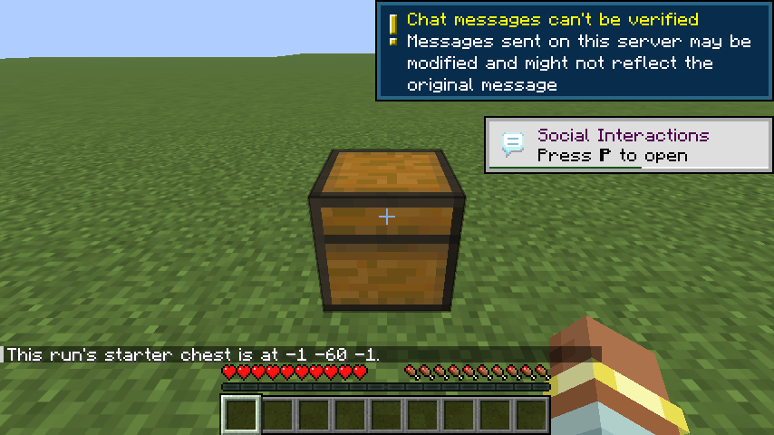 | 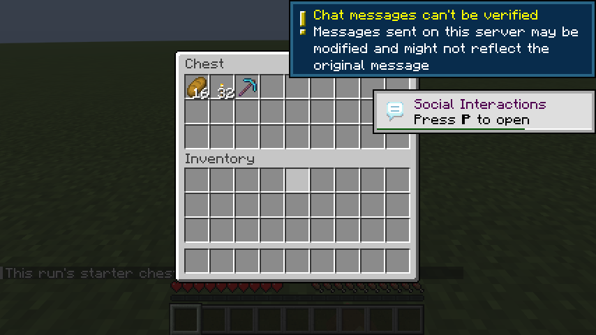 |

#### The world border

Almost all of it is a **server GameTest**, in
`src/gametest/java/fi/vilpponen/mhr/gametest/WorldBorderGameTest.java`. Every scenario picks its
tier the way a player does, with `mhr border <tier>`, and then reads the border vanilla itself is
enforcing rather than asking the mod to repeat its own sums back. Each one also moves the run's
spawn a long way from the origin first, because a border centered on 0, 0 passes whether the
centering works or not.

They are one test method, for the same reason the ore ones are: there is one border per dimension,
one run spawn and one balance override file for the whole server, and GameTest runs the tests of a
batch side by side in the same world — so as separate methods they would take each other's border
away mid-assertion. Inside the one method they run in order, each setting up the spawn and tier it
needs, and each is named in the log the way the client scenarios are:

- **every-tier-takes-its-size-from-balance** — tiny, medium and large are each exactly as wide as
  `worldBorder.<tier>.size` says, in the overworld and in the nether. The expected number is read
  out of the balance in effect, so retuning a tier does not break its test.
- **infinite-removes-the-practical-limit** — the unbounded tier is vanilla's own maximum, wider than
  the largest finite tier, and covers a point two million blocks out.
- **the-border-centers-on-the-run-spawn** — the overworld border sits on the run's spawn, and a tiny
  border a thousand blocks out no longer covers the origin, which is what "it never moved" would
  look like.
- **the-nether-border-follows-the-coordinate-scale** — the nether center is the spawn through the
  dimension's own 1:8 mapping, and every corner of the overworld border maps inside the nether one.
  That last check is the real promise: a portal built *anywhere* in the allowed area is safe, not
  only one built on spawn.
- **the-end-sits-on-the-origin-and-holds-the-arrival-platform** — on every tier the end sits on the
  origin whatever the run did, is the wider of that tier and `endBorder.minimumSize`, and covers
  both the island and the obsidian arrival platform. The width expected is the rule rather than
  today's number, because a retune that lifted a tier above the floor would otherwise turn a
  working feature red.
- **the-end-is-widened-only-when-the-tier-is-narrower-than-its-floor** — the floor itself, on a fixture that
  cannot drift: one tier retuned to a quarter of the minimum and another to four times it. The
  narrow one is widened in the end and left alone in the overworld, the wide one keeps its size.
- **a-balance-that-turns-the-ladder-upside-down-is-refused** — the tiers are a ladder and two things
  read it differently: a run walks the constants, the shop compares sizes. A balance making Medium
  bigger than Large is refused outright and the sizes in effect are left alone, so the two can never
  disagree; a ladder that goes up is still accepted.
- **a-reloaded-override-resizes-the-tier-on-its-next-application** — writing a `worldBorder.medium.size`
  into the config override and running `mhr reload` leaves the border the run is already inside
  exactly as it was, which is what the reload command promises: a world is never resized under the
  player. The *next* application of that tier — the next run, or a tier change — comes out at the
  retuned size, in every dimension and with no rebuild. Taking the override away puts the bundled
  number back the same way.

The last two are the same method's work, but they are not arithmetic and they do not finish in the
tick they start in, so they run on a sequence at the end of it. A portal transition is the one place
a wrong border hides: vanilla drags a portal destination back inside whatever border it is given, so
a nether border left on the raw overworld coordinates strands nobody — it quietly lands the traveller
hundreds of blocks from the portal they walked into, and an "is it inside the border" check on its
own sees nothing wrong. A pig is the traveller, because this server has no players and a mob goes
through a portal the same way one does:

- **a-real-nether-portal-lands-the-traveller-inside-the-nether-border** — a real four-by-five
  obsidian frame built in the test area, with the run's spawn set fifty blocks west of it so the
  portal is inside the tiny border but nowhere near its center. A pig stands in the doorway, walled
  in so it cannot wander off, and the sequence waits for it to turn up in the nether. The arrival
  has to be inside the nether border *and* within a few blocks of where the 1:8 mapping puts the
  portal.
- **a-real-end-transition-lands-the-traveller-inside-the-end-border** — a real end portal block, a
  pig standing in it, and the obsidian platform it lands on has to be inside the end border. That
  platform is a hundred blocks from the origin, which is further out than the tiny tier is wide, so
  the `endBorder.minimumSize` floor is what makes the difference between arriving and arriving
  outside the wall.

No client is involved in any of it. What a border is and where it goes are facts about the server's
own world, and the two journeys ask the same question a player would by sending something through a
real portal — so there is nothing here a real client is needed to answer.

#### The shop

`src/gametest/java/fi/vilpponen/mhr/gametest/server/ShopPurchaseGameTest.java` covers everything
about buying that needs no client, and every scenario accounts for the currency on both sides rather
than asserting one field:

- **with-nothing-to-spend-nothing-can-be-bought** — an empty purse is a refusal, not a free unlock.
- **a-purchase-takes-the-price-once-and-grants-one-level** — the conservation check. It starts with
  more than the price on purpose, so "the purse was emptied" cannot pass for "the price was taken".
- **a-penny-short-buys-nothing-and-costs-nothing**.
- **buying-something-already-owned-is-refused-and-free**.
- **nothing-sells-an-id-the-catalogue-does-not-have** — refused before any money moves, and the id
  is not written into the save file.
- **a-repeatable-unlock-climbs-to-its-ceiling-and-stops** — four levels of the crafted-tool enchant,
  then a refusal, and exactly four levels' worth charged.
- **a-purchase-is-still-there-after-the-snapshot-is-read-again** — progression re-read from disk,
  which is the nearest a test sharing the server's process gets to quitting.
- **the-price-charged-is-the-one-in-the-balance-data** — an override, `/mhr reload`, and the next
  purchase charges the new price.
- **both-halves-of-a-purchase-reach-the-disk-together** — the snapshot is re-read from disk rather
  than trusted in memory, and says both the level and the currency moved.
- **a-purchase-the-disk-will-not-take-changes-nothing-at-all** — a directory is put where the
  snapshot has to go, so the write cannot succeed. The purchase is refused, and the running game
  believes neither half of it; the same purchase then goes through once the way is clear.
- **a-refused-write-leaves-the-previous-progression-whole** — one purchase succeeds, the next cannot
  be written, and the snapshot still holds exactly what the successful one left.
- **a-smaller-border-tier-cannot-be-charged-for-once-a-bigger-one-is-owned** — the tiers are steps
  and the run gets the largest one owned, so a smaller one bought afterwards changes nothing. It
  shows as owned, a purchase is refused, nothing is charged and nothing is written. The rule runs
  one way only: owning the smallest tier leaves every bigger one for sale.
- **an-older-profile-is-carried-into-one-file** — the two files an older build wrote are read and
  arrive in the snapshot whole, levels and currency both, and the old files are left where they are.
- **the-oldest-save-shape-still-reads** — a bare list of ids, from before unlocks had levels.
- **an-id-renamed-since-the-save-was-written-is-carried-over** — `trees` becomes `world.trees`.
- **an-unreadable-snapshot-stops-rather-than-starting-empty** — a damaged snapshot refuses to load
  and is left exactly as it was found, so it can still be repaired. Starting empty is the one
  mistake that cannot be undone: the next purchase writes the empty profile over the real one.
- **a-snapshot-missing-a-field-is-damaged-rather-than-empty** — `{"currency": 100}` parses fine and
  is not a snapshot. Missing `unlocks`, missing `currency`, `unlocks` that are not an object, and a
  currency that is not a whole number each refuse and leave the file untouched; a well-formed one
  still loads, so the five refusals are not just "everything is refused".
- **an-unreadable-legacy-unlock-file-stops-the-migration** — and writes no snapshot at all, because a
  half-read migration committed *is* the loss.
- **an-unreadable-legacy-currency-file-stops-it-too** — the same rule for the other source.

`AtomicFileTest` covers the writer itself in plain JUnit, including a channel that takes one byte per
call — a real file almost never writes short, which is why a missing loop there cannot be provoked
through the public method.

`src/gametest/java/fi/vilpponen/mhr/gametest/client/ShopClientTest.java` is the half that needs a
real screen and a real mouse. Nothing in it calls a purchase helper: the cursor lands on the square
the player would see and the left button goes down.

- **the-shop-opens-with-the-whole-catalogue-on-it** — the screen is told exactly what the server
  sells, and every offer is reachable on the one scrolling page.
- **vanilla-restoration-is-drawn-above-vanilla-plus** — measured on the screen, not in the layout
  code: a world unlock is visible without scrolling and a starter item is below it.
- **clicking-an-affordable-square-buys-it** — the server grants it, charges once, and the screen
  shows both at once.
- **clicking-an-unaffordable-square-changes-nothing**.
- **owned-and-part-upgraded-states-reach-the-screen** — owned, part-upgraded, affordable and out of
  reach all established for real and read back off the screen's own copy.
- **a-retuned-starter-item-is-shown-as-what-it-will-grant** — a starter item is retuned to a
  different item and count, and the open screen follows it, because the reward it draws is the stack
  the server will actually put in the chest rather than a second copy in an icon or language file.
- **an-unrelated-purchase-does-not-resize-the-run** — a border size is reloaded and then something
  that is not a border is bought; the live border must not move. The control is that buying a bigger
  tier still moves it.
- **a-balance-reload-reaches-an-open-shop** — a price is retuned and `/mhr reload` run while the
  shop is open; the screen shows the new price without being reopened, and the click then charges
  what the screen was showing.
- **a-square-that-is-not-drawn-cannot-be-bought** — one scroll notch is smaller than a square, so a
  square can be left undrawn with part of itself still inside the panel. Clicking the whole of where
  it would have been buys nothing; scrolling back and clicking the same square does, which is the
  control.
- **buying-a-border-tier-resizes-the-world** — the only place a border tier is applied to a real
  world, because this test has a dedicated server to itself.
- **a-smaller-border-tier-is-not-for-sale-once-a-bigger-one-is-owned** — the same rule where it can
  be seen: Large is bought, Medium shows as owned on the screen, clicking it costs nothing and
  writes nothing, and the world is still the size Large made it.

The screenshots it takes are evidence rather than debris, and they are taken on the passing path:
`shop-fresh-progression`, `shop-vanilla-plus-below`, `shop-after-buying-trees` and
`shop-some-unlocks-owned`.

**A trap worth knowing.** Buying anything asks the world border to look at the unlocks again, so
without `/mhr border`'s hand-picked override a purchase would put the bought-for border back under a
test that had deliberately gone unbounded to generate far-away terrain. That override is cleared
when a server starts, so it never outlives the world it was picked for. If a worldgen test suddenly
finds empty chunks thousands of blocks out, look at the border before you look at worldgen.

#### Earning the currency

`src/gametest/java/fi/vilpponen/mhr/gametest/client/CurrencyEarningClientTest.java` is the income
side of the economy, played on a real dedicated server with a real client:

- **an-advancement-pays-what-the-balance-table-says** — finishing `story/mine_stone` in a run adds
  the balance file's price for it, and the new total is in the progression snapshot on disk rather
  than only in memory.
- **an-advancement-finished-once-pays-once** — granting the same advancement again pays nothing, and
  neither does a second criterion of `story/obtain_armor`, which any one of four criteria finishes.
  That second half is the one a careless hook fails: it would pay four times for one advancement.
- **an-advancement-the-table-does-not-list-pays-nothing** — most advancements are not in the price
  list, and the control proves the hook is reading it rather than paying for everything.
- **nothing-is-earned-outside-a-run** — the same advancement finished in the lobby pays nothing.
- **the-next-run-earns-the-same-advancements-again** — the scenario the whole economy rests on. A
  run's advancements are cleared as the player crosses into it, so run 2 pays for `mine_stone` just
  as run 1 did.
- **a-crash-cannot-mint-the-same-payout-twice** — the snapshot is read back off the file, which is
  what a restart does, and the advancement is revoked, which is what a record that was never saved
  comes back as. Finishing it again pays nothing. Minecraft saves a player's advancements on its own
  schedule, so without the ledger in the snapshot this is a real way to mint currency.
- **a-payout-the-disk-refuses-leaves-the-advancement-to-be-earned-again** — a directory is put in
  the way of the progression snapshot, so the write genuinely fails, and the advancement is finished
  through `PlayerAdvancements.award` rather than the command. Nothing is paid, the advancement is
  not left recorded as done, and once the file can be written the same milestone pays once and only
  once. An advancement is finished once, so leaving the completion standing would spend the only
  chance that run had to be paid for it.
- **a-stale-advancement-file-does-not-cost-this-run-its-payouts** — the durable state a crash at a
  run boundary leaves, built as the disk would hold it: the advancement finished, the player
  admitted to this run, and the progression snapshot still holding the previous run's ledger. A real
  disconnect and reconnect then walks the real join path, and the milestone is given back and pays
  exactly once. This is the scenario for the rule that the admission mark is not proof the
  advancement reset landed.
- **an-advancement-priced-at-nothing-is-left-alone-on-joining** — a balance override prices an
  existing entry at zero. It pays nothing when finished, so the ledger can never hold a payment for
  it, and joining must not read that absence as "unpaid" and take the player's progress away. The
  control for the scenario above: the reconcile has to skip what does not pay, or it would revoke
  the same advancement on every join for ever.
- **the-purse-is-on-the-screen-while-the-run-is-played** — the client's own copy of the balance
  matches the server's with no screen open, and the shot `currency-hud-during-a-run` is the HUD
  drawing it. Thirteen is the two payouts that scenario makes, three and ten:

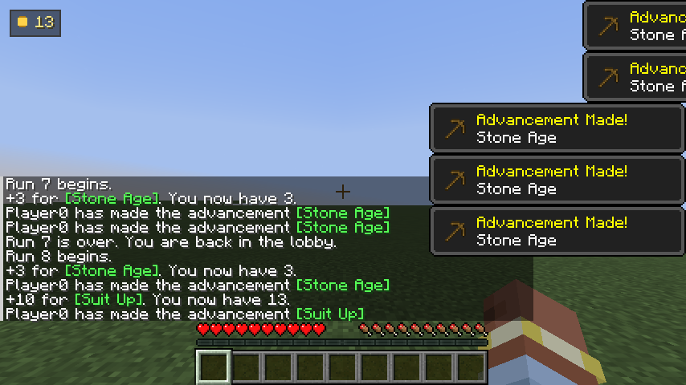

Every scenario reads the purse immediately before the thing it is testing and asserts the
difference. Asserting a total instead would pass or fail on anything else that happened to pay in
the same run.

The storage side of the same rule is in `ShopPurchaseGameTest`, which owns the progression snapshot
for the server batch: a credit survives the file being read again and is refused the second time, a
later run is paid for the same milestone again, and a credit the disk will not take leaves neither
the money nor the note behind.

#### The whole cycle, as one player experience

`src/gametest/java/fi/vilpponen/mhr/gametest/client/ProgressionCycleClientTest.java` is the only
test that crosses all four of the above in one sequence, and the seam it exists for is the one in
the middle: money earned inside a run that is about to be deleted, spent on a screen in the world
that is never deleted, and collected in the world after that. Everything else proves one piece.

It is **one scenario**, `the-whole-roguelite-cycle-once-round`, walked in six named steps. A cycle
is a sequence, and six scenarios that each re-established their own starting point would be
testing the steps rather than the loop — so rather than bend the isolation rule, the loop is one
scenario and the steps are its inside. The first step that fails ends the run there, naming
itself in the failure and in the screenshot; nothing downstream is asserted against state that
step never built. The steps:

- **the-cycle-starts-in-the-lobby-with-an-empty-profile** — and empties the profile itself rather
  than trusting the save to be new, because every scenario establishes the state it depends on.
- **run-one-is-as-restricted-as-an-empty-profile-makes-it** — no starter chest at all, and the tiny
  128-block border. This is the control for both of run 2's assertions.
- **dying-ends-the-run-and-leaves-the-currency-behind** — a real `kill`. The run stops at the lobby
  door and the money does not: the player arrives with nothing, the lobby holds nothing of theirs,
  and the purse still has what the run paid when it is read back off the disk.
- **the-shop-turns-that-currency-into-permanent-unlocks** — two real mouse clicks, charged twice and
  no more, with change left over so "the purse was emptied" cannot pass for "the price was taken".
- **run-two-is-a-fresh-world-that-has-what-was-bought** — run 1's marker block gone from all three
  dimensions, and the two purchases showing up as things in the world: a chest holding sixteen bread,
  and a border four times the width of run 1's — 512 blocks across against 128.
- **progression-outlived-both-runs-and-the-runs-did-not** — both files re-read from disk.

Both runs use a named seed, because the scenarios above assert what is standing around each run's
spawn. Freshness is still never read off that argument — it is the record's own seed differing, the
overworld reporting it, and run 1's markers being gone.

| Run 1, with nothing bought | The shop, holding run 1's pay | Run 2, with what it bought |
| -------------------------- | ----------------------------- | -------------------------- |
| 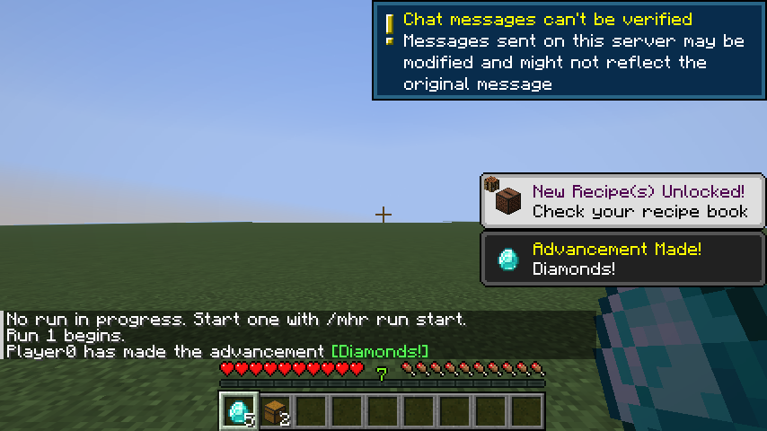 | 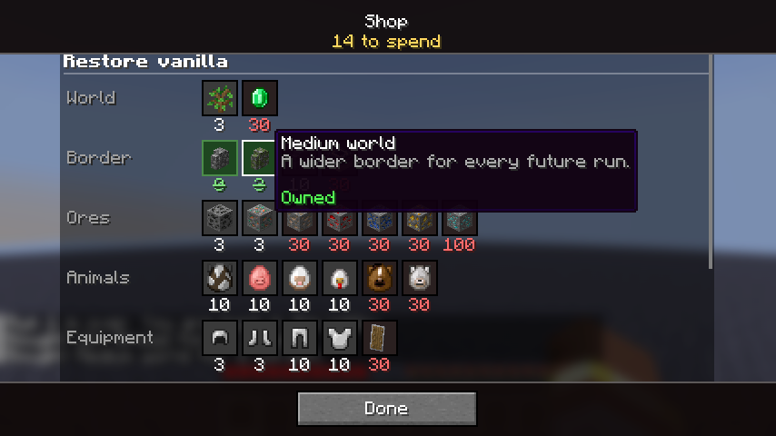 | 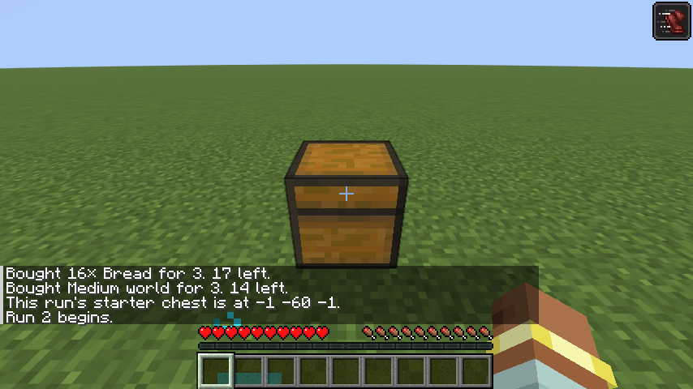 |

#### One save is one roguelite profile

`src/gametest/java/fi/vilpponen/mhr/gametest/client/SaveProfileClientTest.java` creates two real
singleplayer saves from the client — singleplayer rather than the dedicated server, because a
dedicated server is one save for its whole life — and gives them different currency and unlocks
(35 and `world.trees`; 4 and `world.village`). Before either exists it leaves an old-style
installation-wide `config/hardcore-roguelite-progress.json` holding 999 currency and both unlocks.

- **a-new-save-starts-with-nothing** / **a-second-new-save-does-not-see-the-first** — no currency,
  nothing owned, and the snapshot is at that save's root. Not reset first: a new save has to *be*
  empty. The installation-wide leftover showing up here would read 999.
- **reopening-save-a-brings-back-only-its-own-profile** / **reopening-save-b-…** — each save,
  reopened after the other was played, comes back with its own purse and unlock and not the other's,
  read back off its own file. The HUD is screenshotted showing each save's purse.
- **the-installation-keeps-no-progression** — the leftover is byte-for-byte what was put there, and
  each save holds its own snapshot.

The fast version of the same rule is `ProgressSaveScopeTest` (JUnit, two temporary save roots), and
`ShopPurchaseGameTest`'s **progression-lives-in-the-save-and-not-in-the-installation** checks the
server GameTest's own save.

### What is still manual

- The padlock **artwork**. The tests screenshot the inventory with the helmet slot locked and again
  with it unlocked, and those are worth a look when the overlay changes, but nothing compares
  pixels. State assertions are the proof; the screenshots are for debugging.
- **Dispenser-fired armor** and **right-click-to-equip**, which need a block and an aimed
  interaction rather than an inventory screen.
- The **full-inventory fallback**, where a refused item falls at the player's feet.
- Nothing about trees, animals or villages, beyond looking at a world by eye if you want to.
- Nothing about the crafted enchant either, beyond the recipe-book button noted above.
- **How the shop looks**, as opposed to what it says. The scenarios assert the arrangement, the
  states and the purchases, and the screenshots are there to be looked at, but nothing compares
  pixels and nothing can tell you the layout is pleasant.
- **Where the starter chest lands on awkward ground** — a cave, a one-block tunnel, the Nether roof.
  The tests run on the harness's flat world, where the search finds a spot on its first try, so the
  slope and ceiling cases are still a `mhr starterchest` by hand.

## Getting the mod into your own client

```sh
scripts/dev.sh client
```

That is the whole thing. It syncs the checkout to the build pod, runs the same gradle build as
`scripts/dev.sh build` under the same lock, and copies two jars back onto this machine: the mod jar
it just built, and the Fabric API version `gradle.properties` declares. Nothing is built locally —
no JDK and no gradle on the machine you play on — and there is no `kubectl cp` to get right.

On a Mac it installs into `$HOME/Library/Application Support/minecraft/mods`, the official
launcher's directory. That directory has to exist already: start the Fabric 26.3 profile once and
the launcher makes it. Anywhere else — Prism, MultiMC, a second instance, a machine that is not a
Mac — name the directory yourself:

```sh
MHR_CLIENT_MODS_DIR="$HOME/Library/Application Support/PrismLauncher/instances/mhr/.minecraft/mods" \
  scripts/dev.sh client
```

Nothing is ever created for you. A mods directory we invented would be one no launcher reads, which
from the outside looks exactly like a mod that does not work, so a missing directory is an error
that tells you how to point at the right one instead.

Each run replaces `hardcore-roguelite*.jar` and `fabric-api-*.jar` and leaves every other mod in the
directory alone, so old builds cannot pile up and win load order over the one you just made. Both
jars are copied in under names Minecraft ignores and renamed at the end, so a transfer that dies
halfway leaves the client as it was. The Fabric API download is cached in the cluster, so only the
first run after a version bump waits for it.

Then launch the Minecraft 26.3 profile with Fabric Loader 0.19.5 or newer and, if you want the dev
server rather than a single-player world, port-forward it as below.

`client` and `go` are separate on purpose: `go` is the server loop, `client` is the client
install. Neither touches the other's destination.

This is the command that actually runs on the Mac rather than on the Linux box, so `scripts/dev.sh`
has to stay inside what bash 3.2 understands — macOS still ships bash 3.2 and `/usr/bin/env bash`
finds it. Two things that work everywhere else do not work there: `exec {fd}<>file` (bash 4.1) and
`"${arr[@]}"` on an empty array, which bash 3.2 calls an unbound variable under `set -u`. Both bit
this script. Syntax is cheap to check:

```sh
podman run --rm -v "$PWD:/w:ro" -w /w docker.io/library/bash:3.2 bash -n scripts/dev.sh
```

## Joining the server

The server is not exposed outside the cluster. On whichever machine you want to play from:

```sh
kubectl --context eero-pc -n mhr-dev port-forward svc/mhr-server 25565:25565
```

Then add a server in Minecraft pointing at `localhost:25565`.

The server runs with `online-mode=false`, so any username works and you do not need the port-forward
to authenticate. That is fine while it is only reachable through a forward on your own machine, and
is the reason it must not be put on a real network.

To op yourself, once you have joined at least once:

```sh
scripts/dev.sh rcon "op <your-username>"
```

## Testing the trees unlock

Nothing here needs doing by hand any more:

```sh
scripts/dev.sh gametest
```

covers the whole unlock — direct feature placement both ways, fallen trees, saplings, and real
terrain generated from scratch with and without the unlock. See
[Automated gameplay tests](#automated-gameplay-tests). What follows is how to poke at it on the dev
server when you want to *see* it rather than prove it.

Trees are off until the unlock is bought. Buy it in the shop with `/mhr shop`, or skip the currency
and grant it outright with the dev command:

```sh
scripts/dev.sh rcon "mhr list"
scripts/dev.sh rcon "mhr unlock world.trees"
```

Worldgen only applies to chunks generated after the change, so walk into fresh land or start over
with `scripts/dev.sh newworld`. For a quick check without any of that, place the feature directly:

```sh
scripts/dev.sh rcon "forceload add 0 0 16 16"
scripts/dev.sh rcon "fill 0 100 0 8 100 8 minecraft:dirt"
scripts/dev.sh rcon "place feature minecraft:oak 4 101 4"
```

Locked, that answers "Failed to place feature". After `mhr unlock world.trees` it answers "Placed". The progression file lives at `/server/world/hardcore-roguelite-progress.json`
on the volume — at the root of the save, which a new run's dimensions do not touch. One save is one
roguelite profile, so `scripts/dev.sh newworld`, which deletes the whole save, starts a fresh one.

## Testing the villages unlock

Nothing here needs doing by hand any more:

```sh
scripts/dev.sh gametest
```

covers the whole unlock — a village found and built in fresh land with the unlock bought, nothing
found and nothing built in the same terrain without it, and a pillager outpost and a mineshaft still
generating either way. See [Automated gameplay tests](#automated-gameplay-tests). What follows is how
to poke at it on the dev server when you want to *see* it rather than prove it.

Villages are off until the unlock is bought. There is nothing to place directly here, so this one
needs a fresh world each way:

```sh
scripts/dev.sh newworld
scripts/dev.sh rcon "locate structure #minecraft:village"      # "Could not find a structure"
scripts/dev.sh rcon "locate structure minecraft:pillager_outpost"   # still found — other structures are untouched

scripts/dev.sh rcon "mhr unlock world.village"
scripts/dev.sh newworld
scripts/dev.sh rcon "locate structure #minecraft:village"      # found again
```

The second `newworld` matters: `locate` remembers that it already looked at a chunk, so a world
scanned while villages were locked keeps answering "not found" even after the unlock.

## Testing the equipment slots

All five slots start locked. On the server side you can flip them and see the state:

```sh
scripts/dev.sh rcon "mhr list"
scripts/dev.sh rcon "mhr unlock player.slot.offhand"
```

The rest of it — the padlocks, the equip attempts, the swap-hands key — used to need a human in a
real client. It does not any more:

```sh
scripts/dev.sh gametest
```

See [Automated gameplay tests](#automated-gameplay-tests). That runs a real client against a real
dedicated server and covers the locked helmet slot, unlocking while connected, the swap-hands key
both ways, locking a slot that is in use, and the reconnect.

There is one rule behind all of it: **nothing stays in a locked slot**. It is enforced in a single
place, the write barrier on `PlayerEquipment.set`, so the cases below are not five separate
features — they are five ways of asking the same question. What you are really checking each time
is that the item is refused *and* that it is still somewhere you can reach.

Three checks still want a human, because they need a block or an aimed interaction rather than an
inventory screen. Join through the port-forward and check:

- Right-click a helmet held in hand: it stays in your hand.
- Put an item in a dispenser aimed at you and fire it — armor must not go on.
- Fill your inventory completely, then have a locked slot refuse something: it falls at your feet
  rather than vanishing.

The server tells the client which slots are open when you join and again whenever `mhr unlock` or
`mhr lock` changes something, so the client's own config file is never consulted while connected.
Enforcement never reads that copy — it is for drawing only.
## Testing the animal unlocks

Nothing here needs a human in a Minecraft client any more:

```sh
scripts/dev.sh gametest
```

See [What is automated now](#the-animal-unlocks). All six species, the mixed lock states, `/summon`,
the bystanders and the chicken jockey are covered by the server GameTest, and fresh terrain coming
out empty is covered by the client one. Between them that is every check this section used to ask
for by hand.

The dev server is still the place to *look* at it. Unlike trees, an animal unlock takes effect at
once — natural spawning asks every time, so land you have already visited starts or stops producing
that species straight away:

```sh
scripts/dev.sh rcon "mhr lock world.animal.cow"
scripts/dev.sh rcon "mhr list"
```

**Widen the border first** if you go counting animals in fresh land by hand. New land only gets its
animals if it is inside the world border, and the border starts 128 blocks wide, so a patch out at
x=8000 generates perfectly empty and every count reads zero whether the species is locked or not.
That looks exactly like the feature working and is not.

```sh
scripts/dev.sh rcon "mhr border infinite"
scripts/dev.sh rcon "execute positioned 8000 100 8000 run locate biome minecraft:plains"
scripts/dev.sh rcon "forceload add 7904 7904 8159 8159"   # 256 chunks, the per-command maximum
# wait a minute or so for the chunks to generate
scripts/dev.sh rcon "execute if entity @e[type=minecraft:cow,x=7904,y=-64,z=7904,dx=256,dy=384,dz=256]"
```

That answers "Test failed" while the species is locked and "Test passed. Count: N" once it is
unlocked and a *different* fresh patch has been generated. Plains is the biome to pick: cows,
sheep, pigs and chickens all populate it, so one patch tests four species at once — but do not
reach for rabbits or foxes as a control there, because plains has neither. Taiga is the biome for
that, which is why the automated test uses it.

Force-loaded chunks stay loaded and cost memory, so `forceload remove all` between rounds, or
the server eventually gets killed.

## Testing the world border

Nothing here needs doing by hand any more:

```sh
scripts/dev.sh gametest
```

covers all four tiers, all three dimensions, what a balance reload does and does not change, and two
real transitions out of the overworld — a nether portal and an end portal, with a pig as the
traveller. See [Automated gameplay tests](#automated-gameplay-tests). What follows
is how to poke at it on the dev server when you want to *see* it rather than prove it.

A run starts on the `tiny` tier, and the border is placed when the server starts, centered on the
world spawn. The sizes come from the `worldBorder` section of the balance file, not from Java, so
retuning one is editing `default-balance.json` or the config override. Change the tier with the dev
command, which applies it to the running world at once:

```sh
scripts/dev.sh rcon "mhr border"            # what tier is selected
scripts/dev.sh rcon "mhr border medium"     # tiny | medium | large | infinite
scripts/dev.sh rcon "worldborder get"       # vanilla's own read-back, in blocks
```

`/mhr border` overrides by hand for the world it is run in. Left alone, a run gets the largest tier
it owns — bought in the shop, and remembered in the progression snapshot — so a restart comes back
on that rather than on `tiny`.

Each dimension gets its own center, so the server log is the quickest way to see what was applied:

```
World border tier tiny: 128 blocks across, overworld centered on 500, -700
  minecraft:overworld: 128 wide, centered on 500, -699
  minecraft:the_nether: 128 wide, centered on 62, -87
  minecraft:the_end: 512 wide, centered on 0, 0
```

The nether center is the overworld spawn through the 1:8 portal mapping, so a portal built anywhere
inside the overworld border comes out inside the nether one. That is the check
`a-nether-portal-inside-the-border-lands-inside-the-nether-border` makes on every run, with a real
portal and a real traveller. To watch it happen rather than take the test's word for it, move the
spawn far from the origin, build a portal there and walk through it:

```sh
scripts/dev.sh rcon "setworldspawn 500 70 -700"
scripts/dev.sh rcon "mhr border tiny"
scripts/dev.sh rcon "fill 550 69 -700 553 73 -700 minecraft:obsidian"
scripts/dev.sh rcon "fill 551 70 -700 552 72 -700 minecraft:nether_portal[axis=x]"
# then join and step in, or send a mob:
scripts/dev.sh rcon "summon minecraft:pig 551.5 70.0 -699.5"
# a mob waits 300 ticks in the portal, then:
scripts/dev.sh rcon "execute in minecraft:the_nether run data get entity @e[type=pig,limit=1] Pos"
```

The portal is fifty blocks from the spawn rather than on it on purpose: a border that only thought
about the spawn point looks perfect from a portal standing on the spawn.

## Testing the ore unlocks

One unlock per ore: `world.ore.coal`, `world.ore.iron`, `world.ore.copper`, `world.ore.gold`,
`world.ore.redstone`, `world.ore.lapis`, `world.ore.diamond`. None of this needs doing by hand any
more:

```sh
scripts/dev.sh gametest
```

That covers all seven ores locked and unlocked, every mixed pair, nether gold, the deep iron and
copper veins, and the features we do not sell — see
[What is automated now](#the-ore-unlocks). The rest of this section is how to poke at it on the dev
server, which is still the quicker way to look at something surprising.

The quick check places an ore vein in a block of stone and counts what landed:

```sh
scripts/dev.sh rcon "forceload add 0 0 16 16"
scripts/dev.sh rcon "fill 0 96 0 10 106 10 minecraft:stone"
scripts/dev.sh rcon "place feature minecraft:ore_iron 5 101 5"
scripts/dev.sh rcon "fill 0 96 0 10 106 10 minecraft:stone replace minecraft:iron_ore"
```

Locked, the place fails and nothing is filled. After `mhr unlock world.ore.iron` it places and the
last command counts the vein.

For the real thing, force-load land that has never been generated and count what is in it:

```sh
scripts/dev.sh rcon "forceload add 5000 5000 5031 5031"
scripts/dev.sh rcon "fill 5000 -59 5000 5015 60 5015 minecraft:stone replace minecraft:iron_ore"
```

A `fill ... replace` is a block counter that happens to destroy what it counts, so only do it in a
throwaway world. `rcon-cli` also reads commands from stdin, which is much faster than one
`scripts/dev.sh rcon` per command when you are counting fourteen ore blocks across several chunks.

Note that the cluster is shared: if someone else runs `scripts/dev.sh go` while you are testing,
the server restarts under you with their jar. The [run lock](#the-run-lock) stops two builds
trampling each other, but it cannot stop a finished deploy replacing the jar you were looking at,
and the build pod's `/pvc/workspace` is still one tree. For a test that has to be left alone, copy
your tree to a
directory of your own under `/pvc`, build there, and run a second server deployment against its own
`subPath` — then delete it when you are done.

### The large iron and copper veins

The deep veins do not come from an ore feature, so `place feature` cannot reach them and a scan of a
few chunks will usually miss them: they are rare, and only about one block in fifty of a vein is a
raw ore block. Two things make them testable, and both are what the automated scan does:

- `raw_iron_block` and `raw_copper_block` only ever come from a vein, so counting them counts veins
  and nothing else.
- With a fixed seed, a world generated again is exactly the same terrain. Scan the same coordinates
  once with the ore unlocked and once with it locked and the two runs are directly comparable.
  12×12 chunks is enough: the seed the test uses holds 107 raw iron blocks and 5 raw copper ones.

Something not affected by the unlocks should come out at the same count, which is how you know you
really did regenerate the same world. Bedrock is the one to pick, and the one the test compares:
nothing places it, nothing ticks it and no vein reaches it. Do not use coal or any other ore for
this, and do not use a stone variant — an ore vein replaces andesite, diorite and granite as happily
as it replaces stone, so those counts really do change when you lock an ore.

## Testing the crafted-tool enchant

The unlock is repeatable, so `mhr list` shows a level next to it and `mhr unlock` buys the next one:

```sh
scripts/dev.sh rcon "mhr list"
scripts/dev.sh rcon "mhr unlock player.craft.enchant"     # level 1
scripts/dev.sh rcon "mhr unlock player.craft.enchant 4"   # straight to the top level
scripts/dev.sh rcon "mhr lock player.craft.enchant"
```

The levels are kept in the same file as everything else,
`/server/world/hardcore-roguelite-progress.json`, whose shape is the currency and a map of unlock
id to level:

```json
{
  "currency": 35,
  "unlocks": { "player.craft.enchant": 4 }
}
```

A profile written by an older build — two files, and before that a bare list of ids — is read once
and written back in this shape, with the old files left where they are.

How many levels there are and what each is worth are balance numbers, so a curve change needs no
rebuild:

```sh
scripts/dev.sh rcon "mhr balance"   # shows vanillaPlus.craftEnchant
scripts/dev.sh rcon "mhr reload"    # after editing config/hardcore-roguelite-balance.json
```

The crafting itself cannot be done from the server console at all, and it used to be the one thing
here that needed a human in a real client. It does not any more:

```sh
scripts/dev.sh gametest
```

covers the whole unlock — a real client at a real crafting table, the plain result while it is
locked, the enchanted one sitting in the output slot before it is taken, clicking, shift-clicking,
the recipe book, the no-free-reroll rule, the level curve at both ends, a bow staying plain, and a
balance reload landing on the next item crafted. See
[Automated gameplay tests](#automated-gameplay-tests). What follows is how to poke at it on the dev
server when you want to *see* it rather than prove it: join through the port-forward, buy a level
with the command above, and put a pickaxe recipe in a crafting table.

## Testing the starter chest

Nothing here needs a human in a Minecraft client any more:

```sh
scripts/dev.sh gametest
```

See [The starter chest](#the-starter-chest). Between them the two tests cover nothing-owned, the
exact contents, the enchanted item, one chest, a double chest, the overflow past 54, a config
override with `mhr reload`, the first join, the reconnect and a genuinely new run. What follows is
how to poke at it on the dev server when you want to *see* it rather than prove it.

Starter items are ordinary unlocks: they sit in `default-balance.json` under `unlocks` with every
other price, and carry the stack they hand over. See [`balance.md`](balance.md#starter-items).

```json
"starter.bread": { "price": 3, "item": { "id": "minecraft:bread", "count": 16 } }
```

Because it is balance data, the local override on the volume —
`/server/config/hardcore-roguelite-balance.json` — can retune the contents as well as the price,
and `mhr reload` picks the edit up without a restart:

```sh
scripts/dev.sh rcon "mhr reload"
```

What the player *owns* is separate and lives with the other unlocks, outside the world, so it
survives `newworld`.

The chest normally appears when a player first joins a fresh world. To place it from the console
without making a new world:

```sh
scripts/dev.sh rcon "mhr list"                      # unlocks, then the starter items
scripts/dev.sh rcon "mhr unlock starter.bread"
scripts/dev.sh rcon "mhr starterchest 0 64 0"       # position needed from the console
scripts/dev.sh rcon "data get block -1 63 -1"       # it lands next to the spot you named
```

`mhr starterchest` with no position puts it next to you, and only works in game.

`mhr list` ends with whether this run has had its chest yet, which is the flag the automated tests
check by counting chests instead.

Two things about the chest are still worth an eye of your own, because both are about *where* it
lands and the tests run on flat ground where there is nowhere else for it to go:

- The chest lands next to you, at your level — not on the surface above you. Worth checking from
  underground, since that is where the two used to differ: `mhr starterchest 0 20 0` inside solid
  stone should refuse to find a clear spot and say so, while a spot in a cave at y 20 should get a
  chest at y 20 rather than one on the hillside overhead.
- A count in the millions is legal balance data. The tests go a few slots past the 54 and check the
  tally; a really enormous one is the case where "report rather than hang" is worth seeing.

## Resource use

The eero-pc node has 8 CPUs and 15.5 GB, which is the tighter of the two clusters — the Mac has
24 GB. The memory ceilings are sized to hold *simultaneously* rather than one at a time: build
5 GB, gametest 7 GB, server 3 GB, which is 15 GB with the rest left to k3s. That matters because
the build and gametest locks are separate on purpose, so a build and a test run can both be at
their peak while the dev server is up underneath them. A ceiling that only holds when nothing else
is running does not fail as "the node is full" — it fails as an OOM kill partway through a test
run, which reads as a flaky test.

The dev server's heap is 2 GB inside its 3 GB pod, leaving room for the JVM's non-heap overhead.
If you raise one, raise the other.

There is one manifest for both clusters, so applying it to the Mac gives the Mac these ceilings
too — 9 GB below what its node could carry. That is deliberate: one set of numbers that is right
on the tighter node and merely generous on the other beats two manifests that drift apart.

`scripts/dev.sh down` removes the pods but keeps the volume, so bringing it back is fast.

## Known gaps

- Client-side behaviour is tested by the client GameTests in the `mhr-gametest` pod, not by hand —
  see [Automated gameplay tests](#automated-gameplay-tests). There is still no client you can *look*
  at: for exploring by eye you run the real Minecraft client on your own machine through the
  port-forward.
- The mouse button is `InputConstants.MOUSE_BUTTON_LEFT`, which is **1** in 26.3, not 0. 26.3
  takes its input from SDL and SDL numbers buttons from one. Pressing 0 presses nothing at all and
  the test then fails somewhere much later, so it is worth knowing before writing the next one.
- **A shift-click cannot be pressed.** 26.3 reads the modifier keys off the mouse event itself, and
  the harness's `pressMouse` always sends an event with no modifiers on it — so holding shift and
  clicking is an ordinary click, silently. `TestPlayer.shiftClickSlot` puts the button in through
  `MouseHandler.onButton` instead, which is the door the operating system's own mouse callback comes
  through, carrying the modifier a real shift-click carries.
- A run that ends red sometimes leaves its client JVM alive in the pod. The dedicated server lives
  inside that JVM, so the port stays taken and the *next* run would die early with `FAILED TO BIND
  TO PORT` and a `TimeoutException` out of `createServer` — which looks like a broken test and is
  not. The giveaway is that it fails before any scenario is named. `gametest` looks for a leftover
  JVM once it holds the lock, so what you should normally see instead is the command waiting out
  `MHR_STRAY_GRACE` and then stopping to tell you what it found — it does not kill anything unless
  you say so, because from outside it cannot tell debris from somebody running without the lock.
  See [The run lock](#the-run-lock). Once you are sure it is debris, either rerun as

  ```sh
  MHR_KILL_STRAYS=1 scripts/dev.sh gametest
  ```

  or clear it by hand:

  ```sh
  kubectl -n mhr-dev exec deploy/mhr-gametest -- pkill -f KnotClient
  ```
- A `scripts/dev.sh gametest` with a cold Gradle cache waits a long while downloading Minecraft
  again. The pod start itself is no longer part of that: the virtual display is baked into the
  image, see [The gametest image](#the-gametest-image).
- The Gradle `runServer`/`runClient` dev tasks from Loom are not used here; the mod is tested as a
  built jar against a real server, which is closer to how it will ship but slower to iterate.
- Neither cluster exposes 25565 to the LAN, hence the port-forward. On the Mac it is a `kind`
  cluster with no port mappings, so exposing it would mean recreating the cluster; on eero-pc a
  NodePort would work but nobody has needed one.
